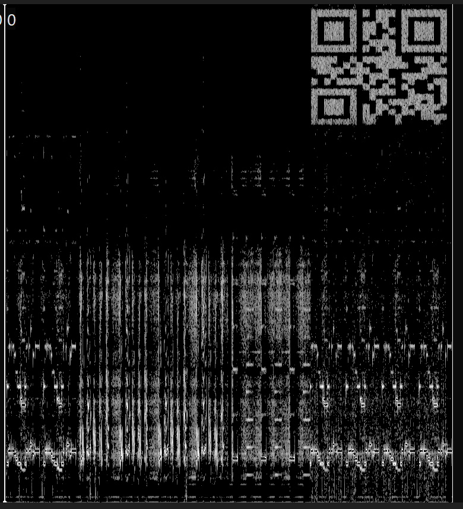

# Writeup
This challenge reuses the files from the challenge `HM01 - Hiding in Plain Sound`. The challenge consists of a zip-file containing the HM01.flac file and a 7z file called LincolnshirePoacher.7z.

When hearing the HM01 audio, numbers in a latin-based language is read aloud. The numbers are: `01441 68532 35731 01441`

They can be used to decrypt the LincolnshirePoacher.7z if used as the password with no spaces: `01441685323573101441`.

This gives two new files: LincolnshirePoacher.flac and fl4g.7z, which is password protected. LincolnshirePoacher.flac also consists of numbers being read aloud. The numbers are: `39715 39715 39715 39715`. Like with HM01, we look at the spectogram of this new flac file with Sonic Visualiser, which shows a QR code:

This QR code when scanned, gives a number string of `21315512568`

The fl4g.7z password is then `3971539715397153971521315512568`
which is the numbers without space and the QR code string added at the end. 

The 7z archive then has the fl4g.txt.txt file which contains the following base64 text: `NDQ0NDQzN2I1MzcwMzM2MzJkNzQ1MjMwMmQ0NzUyMzQ2ZDJkNGQzNDczNTQ2NTUyN2Q=` which decodes to `4444437b537033632d7452302d4752346d2d4d34735465527d` which is hex for the flag `DDC{Sp3c-tR0-GR4m-M4sTeR}`