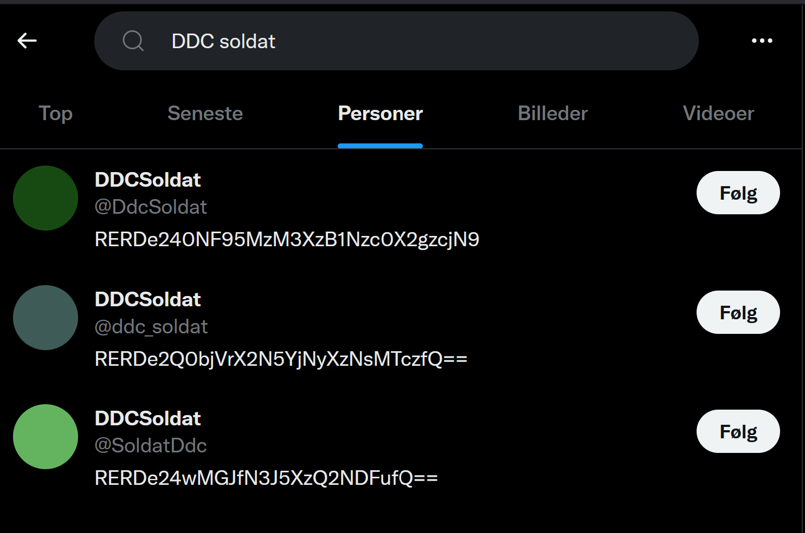

# Writeup
Our defence minister, Morten Bødskov, read a message aloud. It can be found [here](https://twitter.com/jens_myrup/status/1522971870974382082?s=20&t=1WnCkT8OtlzZYZMmyN0whg)

My notes when initialy hearing it was the following:
```
62 dage
91 mål
87 ?

DDC soldat
```

The challenge description mentions that "Colors can be represented in numbers, and you have to look at Elon Musk's"

The first part is fairly straight forward and means that the numbers become the rgb color #3e5b57. The second part refers to Elon Musk's new acquisition of Twitter. As the "DDC Soldat" was mentioned very much, and searching for the hex color on twitter yielded no results, I tried searching for that.



3 users had that name, and of the 3 only one had a profile picture with a color coresponding to the numbers. Each had a base64 encoded flag in their bio. The flag is `DDC{d4n5k_cyb3r_3l173}`